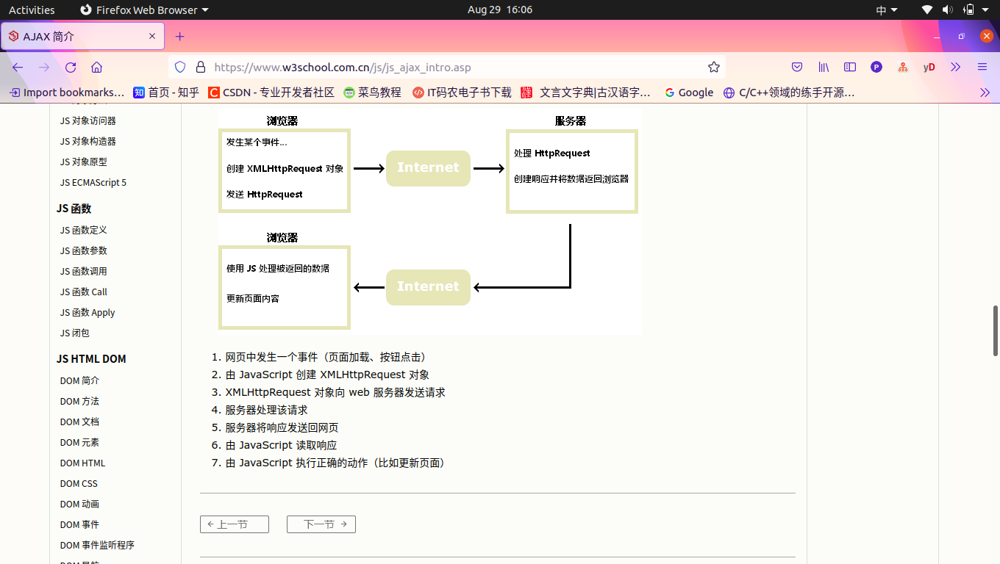

# JS AJAX

1.AJAX是开发者的梦想:

> 1.不刷新页面更新网页
> 2.在页面加载后从服务器请求数据
> 3.在页面加载后从服务器接收数据
> 4.在后台向服务器发送数据

2.AJAX=Asynchronous JavaScript And XML,并非编程语言
3.AJAX组合了浏览器内建的XMLHttpRequest对象(从web服务器请求数据)和JavaScript、HTML DOM(显示或使用数据)

4.200"ok" 403"forbidden" 404"not found"
